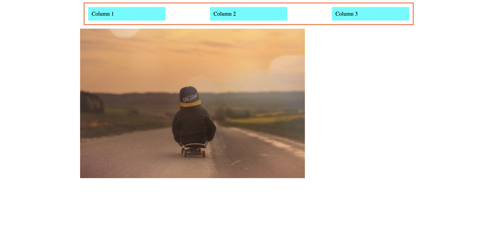
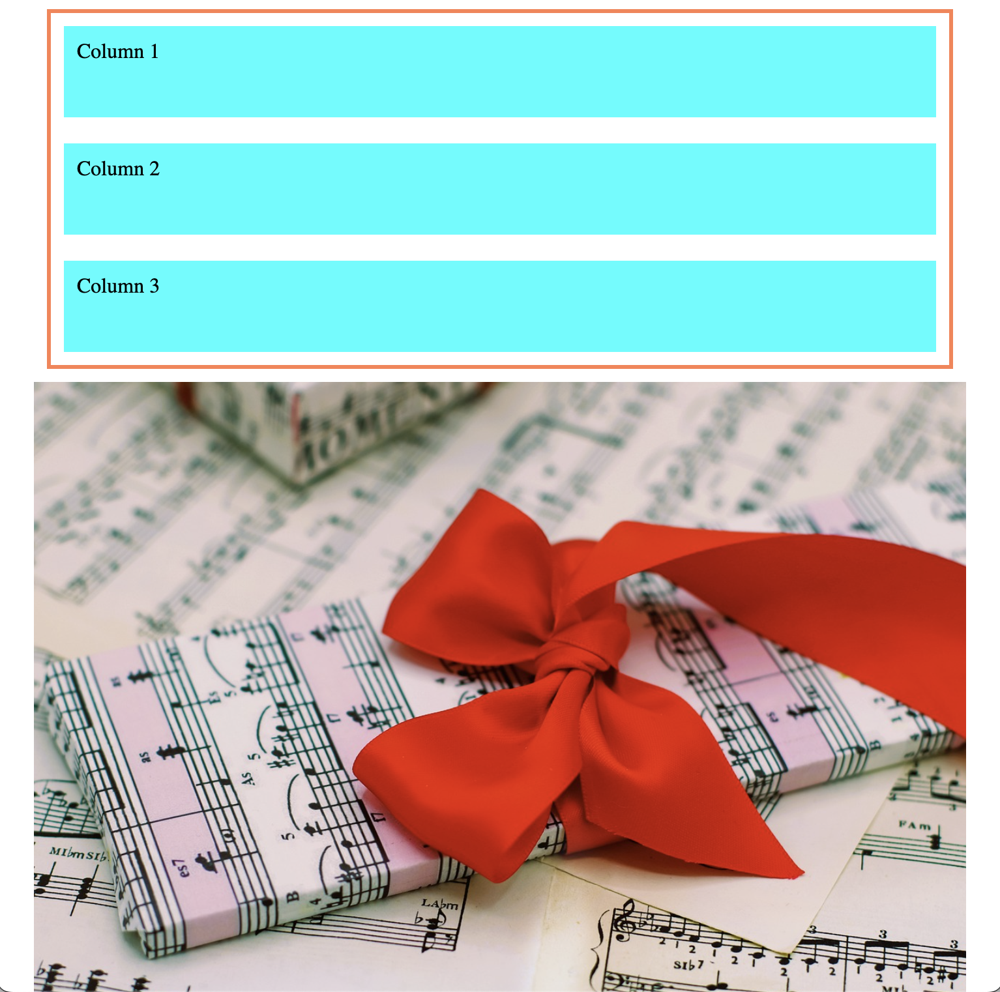

# Media Query Practice

## Steps

- ***Fork*** the repository.
- ***Clone*** down to your local computer
- Edit the `index.html` file 

## Task
Our current desktop view at full screen, is shown below. 

Only editing the `index.html` file inside of the `<style>` element, ensure the layout matches the image below at tablet view (796px)

## Breakout groups
Be sure to use:
* a media query `@media` used in styles.
* each `div` inside of `row` should have a flex-basis of `50px`
* the image changes from `random-image` to `stock-image` at the breaking point
